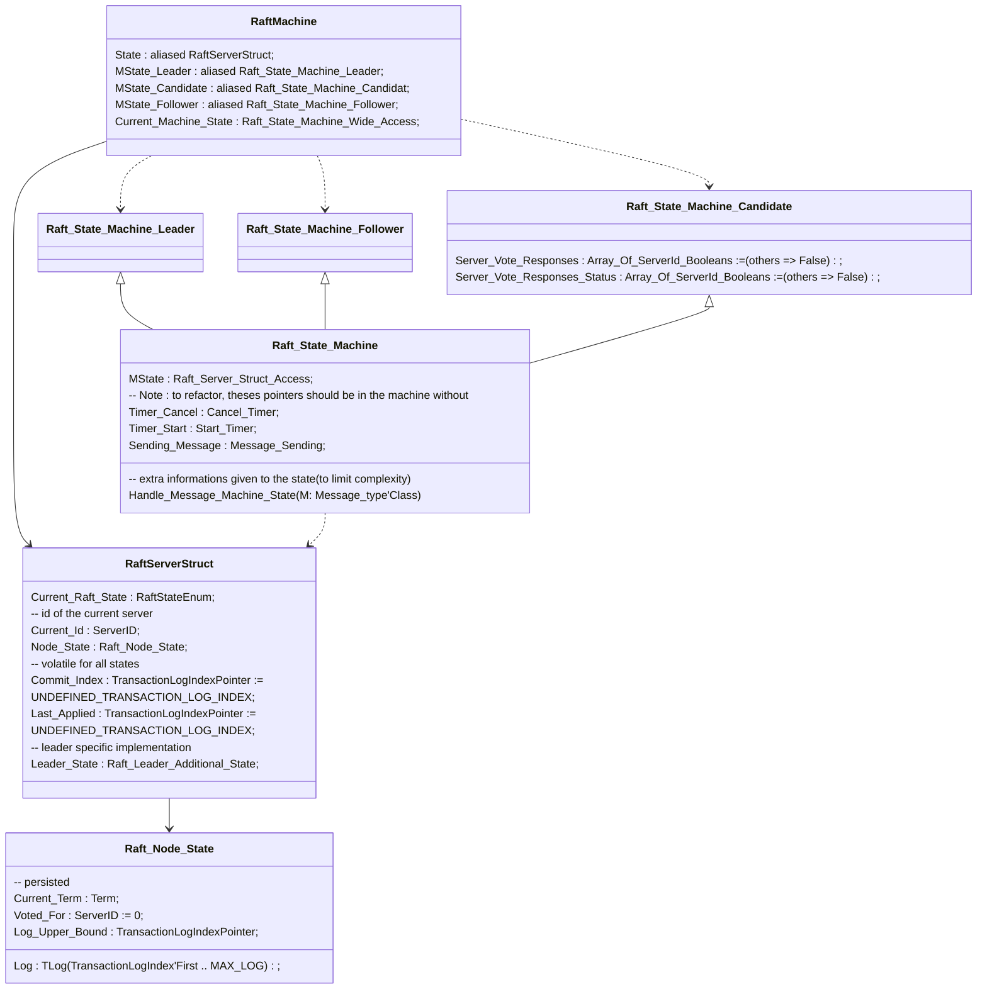

# Raft protocol implementation design

Design is oriented for the library beeing properly and easily tested. This lead to disable time, be able to control message ordering and delays.
=> Time is an issue, to be able to test all conditions

In this implementation, we separate the execution engine (handling messages and behaviours) from the behaviour implementation, this could provide using async/await implementation with message loop, 

# Events

Timers are handled externally, this permit to make some edge and limit cases, to better tests the implementation.

# Communication sub systems

All Nodes are referenced with IDS for communication. These ids are the reference in all communications.

Communication hub -> define the communication means and hosts access (naming).

## Raft Machine

Handle all the state and handle transition changing procedures

### Raft Machine State

Handle all the state's specific behaviour and divise the implementation into localized implementation. The machine state contains a reference to the state. 

## Implementation review

- Message serialization, type serialization
- Simplicity of starting a new project
- Possible applications, illustrations

