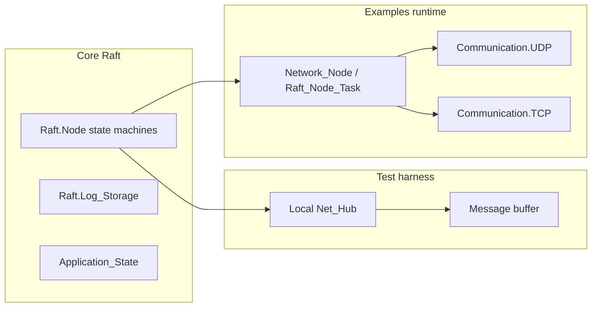
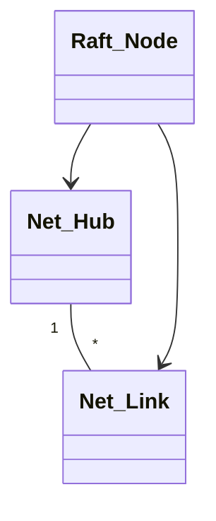
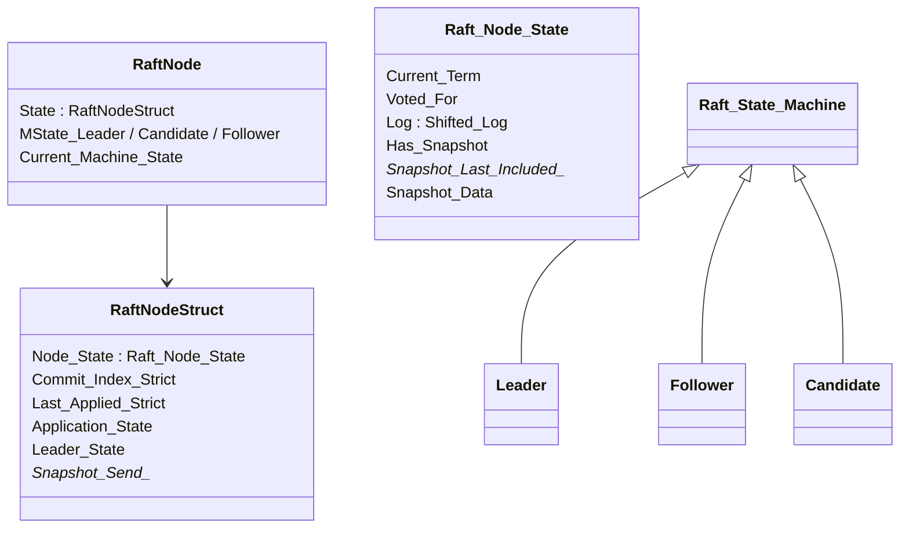
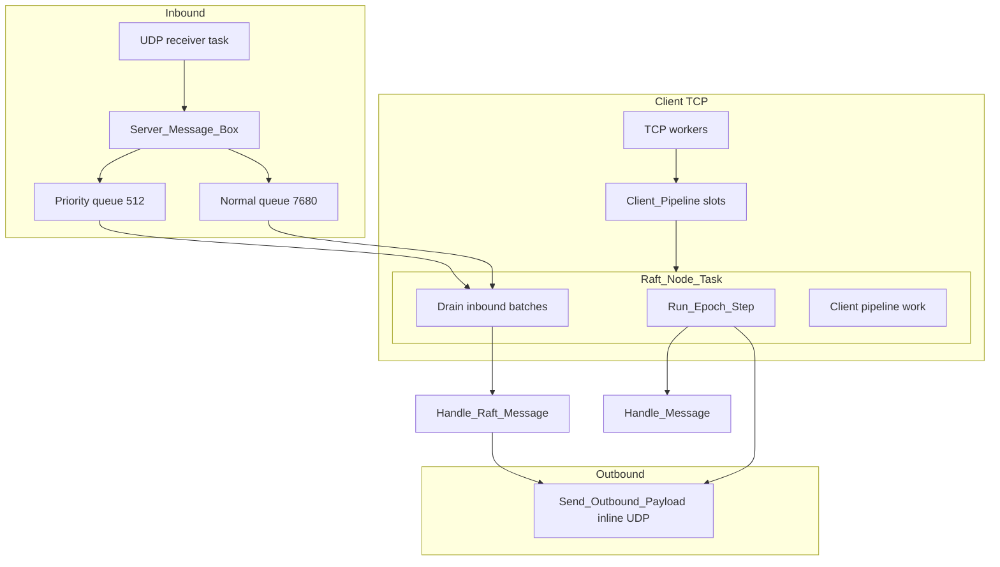

# Raft protocol — design concepts

Design is **test-first**: time and messaging are external so runs are deterministic (epochs, queued delivery, forced timeouts). That makes edge cases — split votes, partitions, compaction, lagging followers — reproducible without wall-clock races.

The **core library** (`src/`) implements Raft against that harness. The **examples cluster** (`examples/`) layers real UDP/TCP I/O, a sync client API, audit ports, and load-oriented scheduling on top — without changing the protocol state machines in `Raft.Node`.

---

## Two layers

| Layer | Where | Time | Messaging |
|-------|-------|------|-----------|
| **Tests** | `tests/`, `Communication.Local` | Logical **epochs** stepped explicitly | In-memory hub + buffer; partitions simulated |
| **Examples** | `examples/src/network_node.adb` | Wall-clock **epochs** (~50 ms) | UDP inter-server RPC, TCP client + audit |


```mermaid
flowchart LR
  subgraph core [Core Raft]
    RN[Raft.Node state machines]
    LS[Raft.Log_Storage]
    SM[Application_State]
  end
  subgraph test [Test harness]
    LH[Local Net_Hub]
    BUF[Message buffer]
  end
  subgraph ex [Examples runtime]
    UDP[Communication.UDP]
    TCP[Communication.TCP]
    NNT[Network_Node / Raft_Node_Task]
  end
  RN --> LH
  RN --> NNT
  NNT --> UDP
  NNT --> TCP
  LH --> BUF
```

Integration details: [library_api.md](library_api.md). Client wire protocol: [examples/doc/client_api.md](../examples/doc/client_api.md). Load scheduling: [examples/doc/scheduling_and_priorities.md](../examples/doc/scheduling_and_priorities.md). Stress and split-brain regression: [stress/split_brain_reproduction.md](../stress/split_brain_reproduction.md).

---

## Events and time

### Tests

Timers live outside the node. Tests step an **epoch** and fire election/heartbeat timeouts explicitly via `Timer_Timeout` messages.

### Examples

Wall-clock drives epochs in `Raft_Node_Task` (`examples/src/network_node.adb`):

| Constant (`example_config.ads`) | Value | Effect |
|---------------------------------|-------|--------|
| `Epoch_Interval` | 0.05 s | One `Run_Epoch_Step` ≈ 50 ms when the loop reaches the epoch boundary |
| `Heartbeat_Interval_Epochs` | 4 | Heartbeat every **~200 ms** |
| `Election_Timeout_Epochs` | 30 (+ jitter) | Follower election timeout **~1.5 s** |
| `Client_Timeout_S` | 10.0 s | Server/client wait for commit |

`Run_Epoch_Step` decrements epoch counters and injects `Timer_Timeout` into `Handle_Message` — the same path tests use, but triggered by real time in examples.

---

## Communication

Nodes do not call each other directly. A **hub + links** model routes RPCs.


```mermaid
classDiagram
    class Net_Hub
    class Net_Link
    class Raft_Node
    Net_Hub "1" -- "*" Net_Link
    Raft_Node --> Net_Hub
    Raft_Node --> Net_Link
```

- **Net_Hub** — naming and `Send`; each node has a **Net_Link** with a receive callback.
- **IDs** — `ServerID_Type` is the address on every RPC.

### Test transport (`Communication.Local`)

Single process, queued delivery, explicit partitions. Used by all protocol tests.

### Examples transport

| Path | Protocol | Port offset | Handler |
|------|----------|-------------|---------|
| Inter-server Raft | UDP | `cluster.toml` raft ports (9101–9103) | `Link_Callback` → `Server_Message_Box` |
| Client sync API | TCP | raft port + **200** (9301–9303) | `Client_Sync_Handler` |
| Audit / monitor | TCP | raft port + **300** (9401–9403) | `Status_Report` via `Audit_Server_Task` |

Inbound UDP is **async** (receiver task enqueues). Outbound UDP is **synchronous** from `Raft_Node_Task`: `Send_Outbound_Payload` calls `Communication.Send` inline (no separate comms task).

---

## Raft node structure


```mermaid
classDiagram
    class RaftNode {
        State : RaftNodeStruct
        MState_Leader / Candidate / Follower
        Current_Machine_State
    }
    class RaftNodeStruct {
        Node_State : Raft_Node_State
        Commit_Index_Strict
        Last_Applied_Strict
        Application_State
        Leader_State
        Snapshot_Send_* 
    }
    class Raft_Node_State {
        Current_Term
        Voted_For
        Log : Shifted_Log
        Has_Snapshot
        Snapshot_Last_Included_*
        Snapshot_Data
    }
    RaftNode --> RaftNodeStruct
    Raft_State_Machine <|-- Leader
    Raft_State_Machine <|-- Follower
    Raft_State_Machine <|-- Candidate
```

**State machines** (`Raft_State_Machine_*`) hold role-specific behaviour; `Handle_Message` dispatches by current role. Shared persistent data sits in `Raft_Node_State`; volatile leader fields (`nextIndex`, `matchIndex`, snapshot send progress) sit in `RaftNodeStruct`.

Examples wire callbacks through `Raft.Comm`:

- `Sending` → `Send_Outbound_Message` (UDP)
- `Ask_For_Timer_Start` / `Ask_For_Cancel_Timer` → epoch counters in `Network_Node`
- Client responses → TCP via `Client_Pipeline` and route table

---

## Transaction log — `Raft.Log_Storage`

The log is no longer a single growing array. **`Shifted_Log`** keeps a fixed **physical** capacity (`MAX_PHYSICAL_INDEX`, default 100 slots) while **logical** indices grow without bound:

- `Base` — first logical index stored in `Slots`
- `Upper` — exclusive end of the logical range
- slot = `logical_index - Base + 1`

Compaction **rebases** `Base` via `Compact_Prefix` / `Reset_After_Snapshot`. If the retained suffix exceeds physical capacity → `Log_Full`.

`Raft.Snapshot` exposes `Log_Term_At`, `Log_Entry_At`, `Has_Log_Entry_At` so RPC handlers use logical indices without touching slot math.

---

## Snapshots and compaction — `Raft.Snapshot`

Triggered after commit advances (`Compact_If_Needed`):

1. Build snapshot blob: 8-byte header (`lastIncludedIndex`, `lastIncludedTerm`) + optional application payload.
2. Set `Has_Snapshot` and snapshot metadata on the node.
3. Trim the physical log prefix (see retention below).

**`COMPACT_THRESHOLD`** — minimum committed entries since last snapshot before compacting.

**`COMPACT_LOG_RETENTION`** (default **0**, opt-in) — after compact, keep the last *N* committed entries in the physical log (snapshot still covers full commit). Lagging followers inside that window catch up via **AppendEntries** instead of **InstallSnapshot** / long `nextIndex` backtracking. Retention is capped when uncommitted entries fill the physical log.

`Follower_Needs_Snapshot` — `false` when `nextIndex` falls inside the retained physical range (`>= Base_Index`).

Leader replication decisions are logged under **`[ leader N replication ]`** (reject reason, backtracking, retention vs snapshot path).

---

## Application state

Raft replicates the **log**; the user owns **application state** via `Raft.State_Machine.Application_State`:

- `Apply_Command` — one committed entry
- `Save_Snapshot` / `Restore_Snapshot` — blob after the 8-byte header

Register with `Create_Machine` (`App_State`). On commit advance, `Apply_Committed_Entries` runs `lastApplied .. commitIndex`. `InstallSnapshot` restores application state and replays the log suffix.

Step-by-step integration: [library_api.md](library_api.md).

---

## Examples runtime — `Network_Node`

Each server process hosts one `Raft_Node_Access`, one **`Raft_Node_Task`** (main loop), TCP listener workers, and an **`Audit_Server_Task`**.


```mermaid
flowchart TB
  subgraph inbound [Inbound]
    UDP_RX[UDP receiver task]
    SMB[Server_Message_Box]
    PRIO[Priority queue 512]
    NORM[Normal queue 7680]
    UDP_RX --> SMB
    SMB --> PRIO
    SMB --> NORM
  end

  subgraph loop [Raft_Node_Task]
    DRAIN[Drain inbound batches]
    EPOCH[Run_Epoch_Step]
    CW[Client pipeline work]
  end

  subgraph client [Client TCP]
    TW[TCP workers]
    CP[Client_Pipeline slots]
    TW --> CP --> loop
  end

  subgraph outbound [Outbound]
    SEND[Send_Outbound_Payload inline UDP]
  end

  PRIO --> DRAIN
  NORM --> DRAIN
  DRAIN --> Handle_Raft_Message
  EPOCH --> Handle_Message
  Handle_Raft_Message --> SEND
  EPOCH --> SEND
```

### Main loop order (`Raft_Node_Task`)

Each iteration (simplified):

1. **Severe backlog** (`pending_inbound > 256`) — drain **priority control** messages only (`AppendEntries_Request`, `Request_Vote_Request`, `Install_Snapshot_Request`).
2. **Inbound drain** — bounded batches (`Max_Inbound_Per_Loop` 64; up to 128 when backlogged; extra rounds when `pending > 32`).
3. **Epoch step** — at most **one** `Run_Epoch_Step` per iteration; then up to **8** more inbound messages (`Max_Inbound_Per_Epoch`).
4. **Client work** — pipeline slots when allowed; **aborted** when inbound is backlogged.
5. **`delay`** — `Loop_Interval` (50 ms) when inbox empty, else `Drain_Yield` (1 ms).

Priority exists so step-down **`AppendEntries`** from a new leader is not starved behind thousands of heartbeat responses under load (split-brain / zombie-leader failure mode).

### Inbound queue (`Server_Message_Box`)

| Queue | Capacity | Contents |
|-------|----------|----------|
| **Priority** | 512 | Inter-server **control requests** (tag-detected) |
| **Normal** | 7680 | Client RPCs, heartbeat responses, other traffic |

Overflow drops **oldest** in the affected queue. Entries are **by-copy** (`Inbound_Entry`, max 16 KiB frame) — no cross-task heap access on dequeue.

### Client path

| Mechanism | Limit | Role |
|-----------|-------|------|
| `Client_Load_Guard` | `Max_Client_In_Flight` = **4** | Fast-reject excess sync TCP on leader |
| `Client_Pipeline` | `Max_Client_Pipeline_Slots` = **1** | Decouple TCP threads from `Raft_Node_Task` |
| `Client_Work_Allowed` | `pending ≤ 16` and not backlogged | Pause new pipeline work under Raft pressure |

Non-leaders reject client work immediately. Leader overload returns error responses without wedging the Raft inbox.

Client work uses **non-blocking** inbox polling (`Try_Fetch_Response`, bounded `Poll_Final_Client_Response`) so a single slot cannot block the main loop indefinitely.

### Outbound

`Sending` → `Send_Outbound_Message` → `Send_Outbound_Payload` → `Communication.Send` on the node's UDP `Net_Link`. Inter-server sends use `Default_Inter_Server_Timeout` (~one heartbeat period).

---

## Monitoring and cluster health

**`raft_monitor`** (`examples/src/raft_monitor.adb`) polls each node's audit TCP port, parses `Status_Report` text, and prints cluster snapshots.

**`Cluster_Health`** (`examples/src/cluster_health.adb`) derives:

| Verdict / tag | Meaning |
|---------------|---------|
| `HEALTHY` | Single leader, all nodes reachable |
| `WARNING` | Overload signals (`pending_inbound ≥ 32`, high `client_rejected`, epoch spread) |
| `CRITICAL: multiple leaders` | Two or more nodes report `LEADER` |
| `OVERLOADED` | Per-node inbound or TCP rejection threshold |
| `WEDGED` | Leader accepts client sends but does not emit responses |

Threshold constants live in `cluster_health.ads`. Field reference: [stress/monitoring.md](../stress/monitoring.md).

---

## Validation

### Unit and system tests

Layers: buffer units, isolated RPCs, 3-node scenarios, compaction/snapshot, **log storage** units, long command runs with periodic compact. See [tests.md](tests.md).

### Stress and regression

The **`stress/`** harness restarts a 3-node cluster, runs parallel `raft_client` load, archives `raft_monitor` output, and synthesizes throughput metrics.

Split-brain / zombie-leader regression:

```bash
cd stress
./reproduce_split_brain.sh
./detect_split_brain.sh results/<run-id>/monitor.log
```

Documented in [stress/split_brain_reproduction.md](../stress/split_brain_reproduction.md).

---

## Open work

- Higher client throughput while keeping single-leader guarantees under burst load
- Durable log/snapshot persistence (examples are in-memory)
- Membership changes (not implemented)
- Broader SPARK proof coverage — see [spark.md](spark.md)
