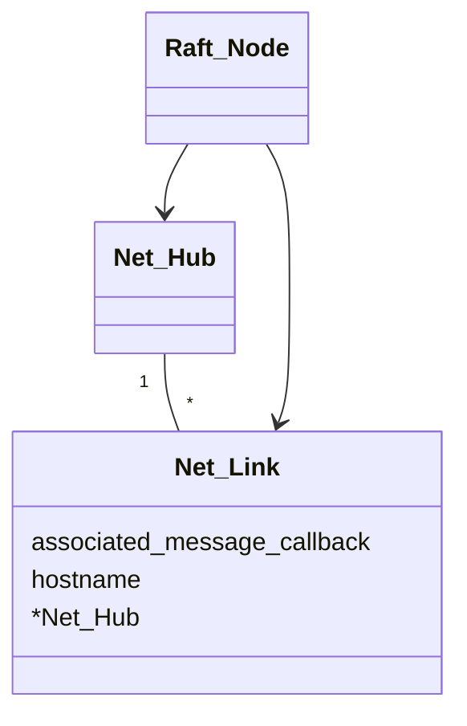
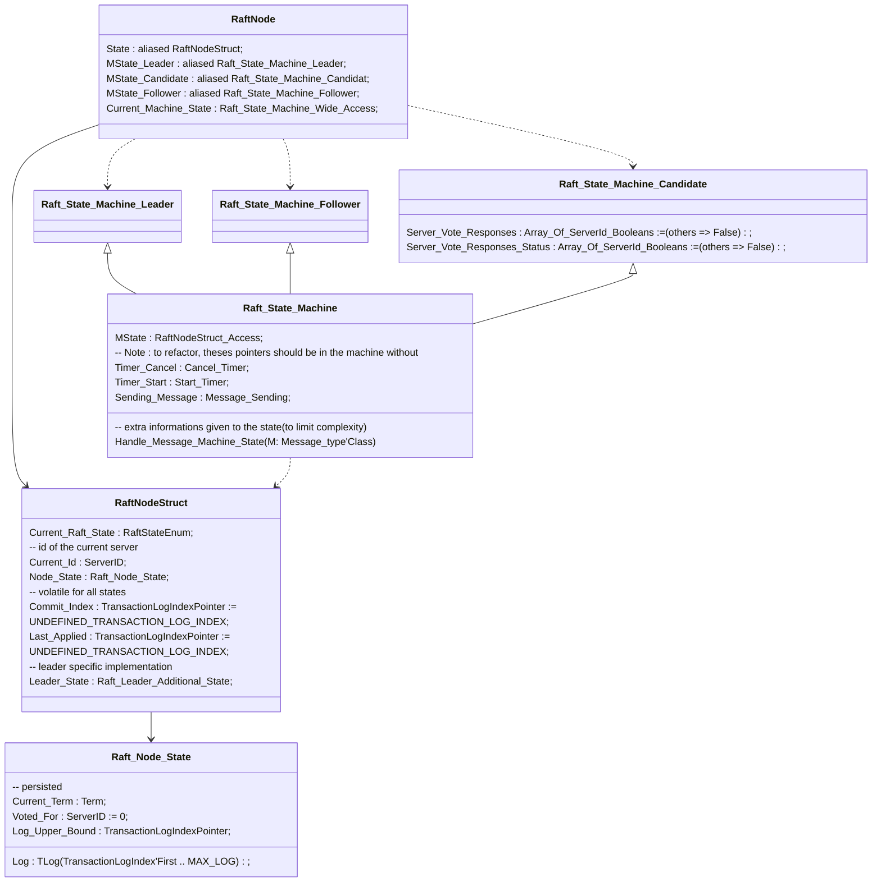

# Raft protocol implementation design concepts

Design is oriented for the library beeing properly and easily tested. This lead to disable time, be able to control message ordering and delays.
=> Time is an issue for proving the working of the protocol, as the protocol is based on timeouts. Evicting time, or providing a time variable (or epoch) then some test condition can be applied.


# Events

Timers are handled externally, this permit to make some edge and limit cases, to better tests the implementation.


# Communication sub systems

A couple of objects define the communication between Raft nodes. There are no links between communication objects and the Raft nodes. This is done externally with a message loop.



```mermaid
classDiagram

    class Net_Hub {
    
    }

    class Net_Link {
        associated_message_callback
        hostname
        *Net_Hub
    }

    Net_Hub "1" -- "*" Net_Link
    

    class Raft_Node {
    
    }

    Raft_Node --> Net_Hub
    Raft_Node --> Net_Link
```

### Net_Hub

The Net_Hub is the object that define the communication means and hosts access (naming). This object is defined along the raft_node. For each RaftNode, a NetLink object is created, referencing a callback procedure for the received messages.

Net Links are created from the NetHub, using the Create_Link procedure.

```
    Create_Link(NetHub, HostName : in Unbounded_String, Callback : in    
        Message_Received_For_Host_Callback; Link : out Net_Link);
```
the callback procedure is defined as,:

```
    procedure Link_Callback(From,To : in Net_Link; Message : in Stream_Element_Array);
```
To centralize the message reception, if multiple nodes are executed on the same process, the from and to parameters are used to determine the origin and destination of the message.


### Sending a message


- to send a message, this is done on the Net_Hub, as the nethub is properly constructed, one can send a message to a specific node. Using the Send procedure : 

- the Net_Link is created from the NetHub , using the Create_Link
- 
- 

```
    Send(L: Net_Hub, Sender, To : in Net_Link, Message : in Message_Type'Class)
```


All Nodes are referenced with IDS for communication. These ids are the reference in all communications.

Communication hub -> define the communication means and hosts access (naming).


## Raft Machine

Handle all the state and handle transition changing procedures



```mermaid
classDiagram

	class RaftNode {
	
        State : aliased RaftNodeStruct;

        MState_Leader    : aliased Raft_State_Machine_Leader;
        MState_Candidate : aliased Raft_State_Machine_Candidat;
        MState_Follower  : aliased Raft_State_Machine_Follower;

        Current_Machine_State : Raft_State_Machine_Wide_Access;
    }
    
    RaftNode ..> Raft_State_Machine_Leader
    RaftNode ..> Raft_State_Machine_Follower
    RaftNode ..> Raft_State_Machine_Candidate
    
    class RaftNodeStruct {
        Current_Raft_State : RaftStateEnum;

        -- id of the current server
        Current_Id : ServerID;

        Node_State : Raft_Node_State;

        -- volatile for all states
        Commit_Index : TransactionLogIndexPointer :=
         UNDEFINED_TRANSACTION_LOG_INDEX;
        Last_Applied : TransactionLogIndexPointer :=
         UNDEFINED_TRANSACTION_LOG_INDEX;

        -- leader specific implementation
        Leader_State : Raft_Leader_Additional_State;
    }
    
    RaftNode --> RaftNodeStruct
    RaftNodeStruct --> Raft_Node_State
    class Raft_Node_State {
        -- persisted
        Current_Term    : Term;
        Voted_For       : ServerID := 0;
        Log             : TLog (TransactionLogIndex'First .. MAX_LOG);
        Log_Upper_Bound : TransactionLogIndexPointer;
    }
    
    class Raft_State_Machine {
    	 MState : RaftNodeStruct_Access;

        -- Note : to refactor, theses pointers should be in the machine without
        -- extra informations given to the state (to limit complexity)
        Timer_Cancel    : Cancel_Timer;
        Timer_Start     : Start_Timer;
        Sending_Message : Message_Sending;
        
        Handle_Message_Machine_State(M: Message_type'Class)

    }
    
    Raft_State_Machine ..> RaftNodeStruct
    
    Raft_State_Machine_Leader <|-- Raft_State_Machine
    Raft_State_Machine_Follower <|-- Raft_State_Machine
    Raft_State_Machine_Candidate <|-- Raft_State_Machine
    
    class Raft_State_Machine_Candidate {
        Server_Vote_Responses : Array_Of_ServerId_Booleans := (others => False);
        Server_Vote_Responses_Status : Array_Of_ServerId_Booleans := (others => False);
    }
```


### Raft Machine State

Handle all the state's specific behaviour and divise the implementation into localized implementation. The machine state contains a reference to the state. 


## Implementation review

- Message serialization, type serialization
- Simplicity of starting a new project
- Possible applications, illustrations


