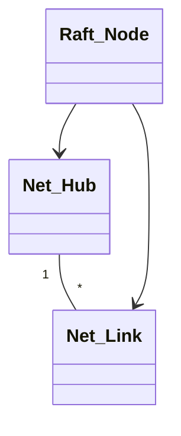
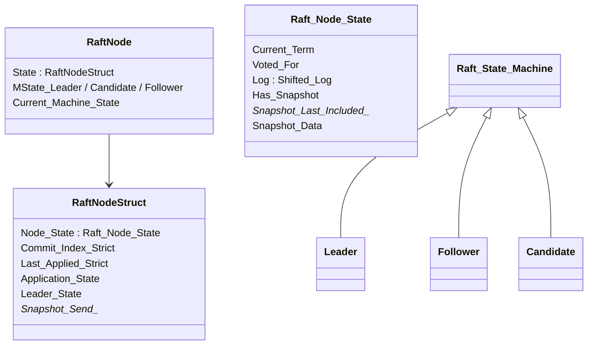

# Raft protocol — design concepts

Design is **test-first**: time and messaging are external so runs are deterministic (epochs, queued delivery, forced timeouts). That makes edge cases — split votes, partitions, compaction, lagging followers — reproducible without wall-clock races.

## Events and time

Timers live outside the node. Tests step an **epoch** and fire election/heartbeat timeouts explicitly.

## Communication

Nodes do not talk to each other directly. A **message loop** (buffer + hub/links) routes RPCs; partitions and delivery order are test-controlled.

```mermaid
classDiagram
    class Net_Hub
    class Net_Link
    class Raft_Node
    Net_Hub "1" -- "*" Net_Link
    Raft_Node --> Net_Hub
    Raft_Node --> Net_Link
```

- **Net_Hub** — naming and `Send`; each node has a **Net_Link** with a receive callback.
- **IDs** — `ServerID_Type` is the address on every RPC.

## Raft node structure

```mermaid
classDiagram
    class RaftNode {
        State : RaftNodeStruct
        MState_Leader / Candidate / Follower
        Current_Machine_State
    }
    class RaftNodeStruct {
        Node_State : Raft_Node_State
        Commit_Index_Strict
        Last_Applied_Strict
        Application_State
        Leader_State
        Snapshot_Send_* 
    }
    class Raft_Node_State {
        Current_Term
        Voted_For
        Log : Shifted_Log
        Has_Snapshot
        Snapshot_Last_Included_*
        Snapshot_Data
    }
    RaftNode --> RaftNodeStruct
    Raft_State_Machine <|-- Leader
    Raft_State_Machine <|-- Follower
    Raft_State_Machine <|-- Candidate
```

**State machines** (`Raft_State_Machine_*`) hold role-specific behaviour; `Handle_Message` dispatches by current role. Shared persistent data sits in `Raft_Node_State`; volatile leader fields (`nextIndex`, `matchIndex`, snapshot send progress) sit in `RaftNodeStruct`.

## Transaction log — `Raft.Log_Storage`

The log is no longer a single growing array. **`Shifted_Log`** keeps a fixed **physical** capacity (`MAX_PHYSICAL_INDEX`, default 100 slots) while **logical** indices grow without bound:

- `Base` — first logical index stored in `Slots`
- `Upper` — exclusive end of the logical range
- slot = `logical_index - Base + 1`

Compaction **rebases** `Base` via `Compact_Prefix` / `Reset_After_Snapshot`. If the retained suffix exceeds physical capacity → `Log_Full`.

`Raft.Snapshot` exposes `Log_Term_At`, `Log_Entry_At`, `Has_Log_Entry_At` so RPC handlers use logical indices without touching slot math.

## Snapshots and compaction — `Raft.Snapshot`

Triggered after commit advances (`Compact_If_Needed`):

1. Build snapshot blob: 8-byte header (`lastIncludedIndex`, `lastIncludedTerm`) + optional application payload.
2. Set `Has_Snapshot` and snapshot metadata on the node.
3. Trim the physical log prefix (see retention below).

**`COMPACT_THRESHOLD`** — minimum committed entries since last snapshot before compacting.

**`COMPACT_LOG_RETENTION`** (default **0**, opt-in) — after compact, keep the last *N* committed entries in the physical log (snapshot still covers full commit). Lagging followers inside that window catch up via **AppendEntries** instead of **InstallSnapshot** / long `nextIndex` backtracking. Retention is capped when uncommitted entries fill the physical log.

`Follower_Needs_Snapshot` — `false` when `nextIndex` falls inside the retained physical range (`>= Base_Index`).

Leader replication decisions are logged under **`[ leader N replication ]`** (reject reason, backtracking, retention vs snapshot path).

## Application state

Raft replicates the **log**; the user owns **application state** via `Raft.State_Machine.Application_State`:

- `Apply_Command` — one committed entry
- `Save_Snapshot` / `Restore_Snapshot` — blob after the 8-byte header

Register with `Create_Machine` (`App_State`). On commit advance, `Apply_Committed_Entries` runs `lastApplied .. commitIndex`. `InstallSnapshot` restores application state and replays the log suffix.

## Tests

Layers: buffer units, isolated RPCs, 3-node scenarios, compaction/snapshot, **log storage** units, long command runs with periodic compact. See [tests.md](tests.md).
