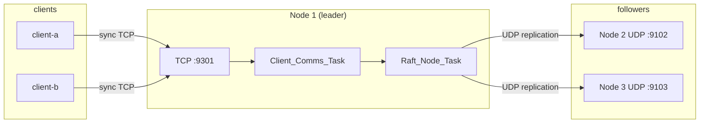

# Client API

This document describes how external clients talk to the AdaRaft examples cluster:
endpoints, wire protocol, RPC semantics, CLI usage, and server behaviour under
concurrent load.

The reference implementation is `examples/bin/raft_client` (wrapper: `client.sh`).
Inter-node Raft traffic (AppendEntries, RequestVote, …) uses **UDP** on ports
`9101–9103`. The **client API** uses **synchronous TCP** on separate ports.

---

## Endpoints

| Role | Transport | Default host | Default port | Notes |
|------|-----------|--------------|--------------|-------|
| Raft node *n* (inter-server) | UDP | `127.0.0.1` | `9100 + n` | From `cluster.toml` `[[nodes]]` |
| Client API on node *n* | TCP (sync) | same as node | **`raft_port + 200`** | Leader serves requests |

With the stock `cluster.toml`:

| Node | Raft UDP | Client TCP |
|------|----------|------------|
| 1 | 9101 | **9301** |
| 2 | 9102 | **9302** |
| 3 | 9103 | **9303** |

Clients read node addresses from the cluster TOML (`-c cluster.toml`). They
probe nodes until they find the current leader, then open TCP connections to that
node’s **client API port**.

There is **no HTTP**. Each RPC is one short-lived TCP connection: connect → send
one request frame → read one response frame → close.

---

## Wire protocol (TCP sync)

### Connection pattern

```
Client                                 Leader (client TCP port)
  |  TCP connect                           |
  |--------------------------------------->|
  |  request frame (binary)                |
  |--------------------------------------->|
  |  response frame (binary)               |
  |<---------------------------------------|
  |  TCP close                             |
  |--------------------------------------->|
```

Implementation: `Communication.TCP.Send_Sync` (client) and the sync handler on
the server (`Client_Sync_Handler` in `network_node.adb`).

### Frame layout

Every message on the wire is a length-prefixed frame:

```
┌────────────────┬──────────────┬─────────────────────┬──────────────────┐
│ body_len (BE32)│ name_len(BE16)│ sender_name (UTF-8) │ payload (bytes)  │
│ 4 bytes        │ 2 bytes       │ name_len bytes      │ remainder        │
└────────────────┴──────────────┴─────────────────────┴──────────────────┘
```

- **body_len**: length of `name_len + sender_name + payload`.
- **sender_name**: client identity string (CLI `--name`, default `client`).
  Names that look like server ids (`server-1`, …) are treated as inter-server
  traffic, not client API traffic.
- **payload**: Ada stream-serialized `Message_Type'Class` (tag + fields).

The response uses the same framing; the sender name in the response frame is the
local server hostname (e.g. `server-1`).

### Payload encoding

RPC bodies are **not JSON**. They use Ada’s `Streams` attribute encoding for
tagged Raft message types (`Raft.Messages`). To implement a foreign client you
must reproduce that binary format or add a separate gateway.

Supported client RPC types today:

| Request | Response | Raft paper |
|---------|----------|------------|
| `Request_Register_Client` | `Response_Register_Client` | §6.3 RegisterClient |
| `Request_Send_Command` | `Response_Send_Command` | §6.2 ClientRequest |

`Request_Client_Query` / `Response_Client_Query` (§6.4) exist in the protocol
but linearizable queries are **not implemented** on the leader yet.

---

## RPC semantics

### RegisterClient — `Request_Register_Client`

Empty request. Only the **leader** assigns a session.

**Success** (`Response_Register_Client`):

| Field | Meaning |
|-------|---------|
| `Client_Id` | Session id on the leader (monotonic per cluster) |
| `Leader_Id` | Current leader server id |
| `Not_Leader` | `False` |
| `Error` | `False` |

**Redirect** (contacted a follower):

| Field | Meaning |
|-------|---------|
| `Not_Leader` | `True` |
| `Leader_Id` | Hint: current or last known leader |
| `Client_Id` | `NO_CLIENT_ID` |

The client library rotates through cluster nodes until registration succeeds or
times out.

### ClientRequest — `Request_Send_Command`

| Field | Meaning |
|-------|---------|
| `Command` | Application command (examples: `Test_Command` with integer `Value`) |
| `Client_Id` | From registration |
| `Serial` | Per-session command serial (0, 1, 2, …); leader deduplicates on `(Client_Id, Serial)` |

**Success** (`Response_Send_Command`):

| Field | Meaning |
|-------|---------|
| `Command_Committed` | `True` when entry is committed **and** applied |
| `Client_Id`, `Serial` | Echo of request |
| `Leader_Id` | Leader that handled the request |
| `Log_Index` | Index of the command in the Raft log |
| `Not_Leader`, `Error` | `False` |

**Redirect / error**:

| Condition | `Not_Leader` | `Error` | Client action |
|-----------|--------------|---------|---------------|
| Not leader | `True` | `False` | Retry on `Leader_Id` |
| Unknown / expired session | `False` | `True` | Re-register, retry send |
| Timeout (no final response) | — | — | Client raises `Client_Timeout` after 10 s |

In the examples application, each committed `Test_Command` adds its integer
`Value` to a replicated `Sum` on all nodes.

---

## Client identity (`--name`)

The `--name` argument sets the **wire sender name** embedded in every TCP
frame. It is **not** the Raft `Client_Id`:

- **`--name`** — logical client label on the network (e.g. `client-a`, `a`).
  Used for routing/logging on the server.
- **`Client_Id`** — assigned by the leader at registration; used in RPCs and
  serial deduplication.

Two processes with different `--name` values are distinct wire identities. Two
processes with the same name but separate registrations receive different
`Client_Id` values.

Constraints: non-empty, max 32 characters (`Example_Config.Max_Client_Name_Length`).

---

## CLI tools

### `raft_client`

```text
usage: raft_client -c <cluster.toml> [--name NAME] [command ...]
```

| Option | Default | Purpose |
|--------|---------|---------|
| `-c`, `--config` | *(required)* | Cluster TOML |
| `--name` | `client` | Wire sender name |
| `--host`, `--port` | `127.0.0.1`, `9200` | Legacy UDP client settings; **ignored** for sync TCP |

### `client.sh`

Thin wrapper around `bin/raft_client` with `CONFIG` and `CLIENT_NAME` environment
variables:

```bash
./client.sh register
./client.sh --name client-a send 42
CLIENT_NAME=client-b ./client.sh send 100
```

---

## Commands and behaviour

### Shell commands

| Command | Description |
|---------|-------------|
| `register` | Find leader, open session, print `client_id` / `leader` / `next_serial` |
| `reconnect` | Rediscover leader after election; keep or renew session |
| `send <int> [ <int> ... ]` | Send one or more test commands (increasing serial) |
| `status` | Print local session state |
| `audit` | Print TCP audit counters |
| `help` | Shell help |
| `quit`, `exit` | Leave interactive shell |

### Interactive vs one-shot

| Mode | How detected | `send` behaviour |
|------|--------------|------------------|
| **Interactive shell** | stdin is a TTY (`./client.sh` with no args) | Session stays open across commands; `send` uses existing session or registers once |
| **One-shot CLI** | stdin is not a TTY, e.g. `./client.sh send 56` | **Register → send → disconnect** for each invocation |

One-shot example:

```bash
./bin/raft_client -c cluster.toml --name a send 56
```

Typical output:

```text
registered client id= 2 leader= 1 next_serial= 0
send serial= 0 committed=TRUE leader= 1 index= 1
```

After a one-shot `send`, the local session is cleared (`Disconnect_Session`);
the process exits. The next `./client.sh send` performs a fresh registration.

### Leader discovery (client library)

1. If a leader is cached, try it first.
2. Otherwise probe servers `1 .. N` with `RegisterClient`.
3. On `Not_Leader`, follow `Leader_Id` hint.
4. On send, retry on redirect; re-register if `Error` indicates unknown session.
5. While a command is in flight, idempotent retries use the same `(Client_Id, Serial)`.

Default wall-clock timeout: **10 s** (`Example_Config.Client_Timeout_S`).

---

## Server-side handling

Each Raft node runs three cooperating tasks (`network_node.adb`):

| Task | Role |
|------|------|
| TCP listener workers | Accept client connections, read frames |
| `Client_Comms_Task` | Hand request to Raft task, return sync response |
| `Raft_Node_Task` | Run Raft epoch loop, process client work, replication |

Client requests are processed **one at a time per node** through a single-slot
mailbox (`Client_Message_Box` → `Raft_Client_Mailbox`). Concurrent TCP
connections are accepted (up to 32 workers) but **serialized** at the Raft
integration layer.

While a client command waits for commit, the leader still:

- drains inter-node UDP (`Drain_Server_Messages`),
- ticks Raft timers (`Run_Epoch_Step`),
- advances replication and notifies the client when `Command_Committed` is true.

Limits:

| Limit | Value |
|-------|-------|
| Active client sessions per leader | 16 (`MAX_CLIENT_SESSIONS`) |
| Pending client commands | table size in `raft-node.ads` |

For load testing, prefer moderate **concurrency** (see `send_load_dual_clients.sh`)
so serialized server handling does not cause client timeouts.

---

## Error messages (CLI)

| Message | Typical cause |
|---------|----------------|
| `registration failed (cluster unreachable or no leader)` | Cluster down, no leader elected, TCP failure |
| `send failed: not registered` | Interactive send without prior `register` |
| `send failed: timed out waiting for commit` | Replication stuck; check `logs/node-*.log` |
| `send failed: timed out waiting for leader` | Leader discovery failed within timeout |
| `send failed: cluster unreachable` | TCP `Send_Sync` I/O error |

---

## Quick start

```bash
# Terminal 1 — start cluster
cd examples
./launch.sh start

# Terminal 2 — one-shot send
./client.sh --name client-a send 42

# Interactive session
./client.sh
> register
> send 1
> send 2
> status
> quit
```

### Load test (two identities)

```bash
COMMANDS_PER_CLIENT=100 CONCURRENCY=4 ./scripts/send_load_dual_clients.sh
```

Runs parallel batches of `./client.sh send` for `client-a` and `client-b`.

---

## Architecture diagram



---

## Related files

| File | Role |
|------|------|
| `examples/cluster.toml` | Node hosts and Raft UDP ports |
| `examples/src/example_config.ads` | Client TCP port offset (+200), timeouts |
| `examples/src/network_client.adb` | Client TCP hub, sync send, session API |
| `examples/src/network_node.adb` | Server sync handler, tasks, mailboxes |
| `examples/src/raft_client.adb` | CLI and one-shot / interactive behaviour |
| `src/communication-tcp.adb` | Frame codec, `Send_Sync`, listener |
| `src/raft-messages.ads` | `Request_*` / `Response_*` client RPC types |
| `src/raft-client.adb` | Register / send state machine, leader redirect |
