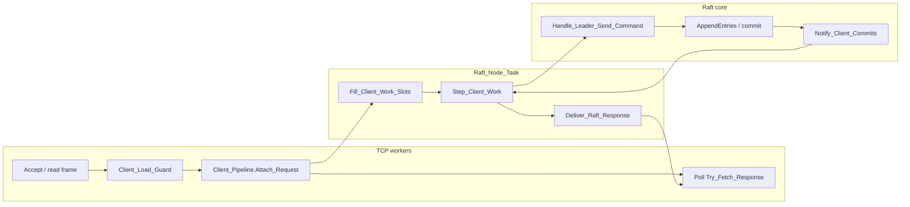

# Client connections, queues, and load-stress behaviour

This article describes how the **examples** Raft servers accept client traffic,
queue work, and degrade under load. It reflects the current code in
`examples/src/network_node.adb` and `examples/src/example_config.ads`.

Related docs:

- [client_api.md](client_api.md) — wire protocol, RPCs, CLI
- [scheduling_and_priorities.md](scheduling_and_priorities.md) — older notes on
  heartbeat slippage (architecture section there is partly historical)

## Server implementation units

`Network_Node` remains the public facade. The server implementation is organized as:

| Unit | Responsibility |
|------|----------------|
| `Network_Node.Shared` | Node-wide state, configuration, logging, and metrics |
| `Network_Node.Inbound` | Priority inbound queue and drain/backlog accounting |
| `Network_Node.Outbound` | Asynchronous UDP mailbox and sender task |
| `Network_Node.Client_API` | Sync client admission, pipeline, and response handling |
| `Network_Node.Audit` | Audit TCP listener and framed status responses |
| `Network_Node.Engine` | Raft callbacks, timers, initialization, and main task |


---

## Summary

| Layer | What it does today |
|-------|--------------------|
| Client TCP | One short-lived sync connection per RPC (`connect → request → response → close`) |
| Admission | `Max_Client_In_Flight` (4) concurrent sync handlers on the leader |
| Pipeline | `Max_Client_Pipeline_Slots` (**1**) between TCP and `Raft_Node_Task` |
| Raft inbox | Split queue: priority control (512) + normal (7680); drop-oldest on overflow |
| Raft outbound | `Outbound_Mailbox` (2048) + `Server_Outbound_Task`; drop-oldest |
| Under backlog | Pause **new** client Fill; keep stepping in-flight waiters; return **`Busy`** (not session `Error`) |
| Load harness | One `raft_client` process at a time per `--name` (exclusive lock) |

Raft can look **HEALTHY** on the audit port while the **client TCP path** is
wedged (frozen `app_sum`, `CLOSE-WAIT` sockets, load timeouts). Treat those as
different failure modes.

---

## Connection model

### Ports

| Traffic | Transport | Port (stock `cluster.toml`) |
|---------|-----------|-----------------------------|
| Inter-server Raft | UDP | 9101–9103 |
| Client API | TCP sync | **9301–9303** (`raft_port + 200`) |
| Audit / monitor | TCP | 9401–9403 (`raft_port + 300`) |

Clients discover the leader by probing client TCP ports, then send RPCs only to
the leader. Followers answer with `Not_Leader` + `Leader_Id` hint.

### Sync RPC lifetime

```text
raft_client                         leader :930x
    |  TCP connect                       |
    |----------------------------------->|
    |  length-prefixed request frame     |
    |----------------------------------->|
    |         Client_Sync_Handler        |
    |         (may wait up to            |
    |          Client_Timeout_S)         |
    |  length-prefixed response frame    |
    |<-----------------------------------|
    |  close                             |
```

There is **no** long-lived client session socket. Registration state lives in
Raft session tables keyed by `Client_Id`; the wire name (`--name A`) is only
used for framing / routing hints.

Default client wait: `Client_Timeout_S` (**2.0 s** in current
`example_config.ads`). Probe timeout: `Client_Probe_Timeout_S` (10 s).

---

## Path from TCP accept to commit reply



1. **TCP worker** runs `Client_Sync_Handler`.
2. If not leader → immediate redirect (`Not_Leader`, `Error=False`).
3. If inbound Raft backlogged → immediate **`Busy`**.
4. **`Client_Load_Guard.Try_Accept`** — if `In_Flight >= Max_Client_In_Flight` → **`Busy`**.
5. **`Client_Pipeline.Attach_Request`** — if no free slot (`Max_Client_Pipeline_Slots`) → **`Busy`**.
6. Handler polls `Try_Fetch_Response` until ready or `Client_Timeout_S`.
7. `Raft_Node_Task` **Fill**s a work slot, dispatches into Raft, polls the shared
   client inbox for a final response (`Command_Committed`, redirect, busy, or
   hard error), then **Deliver**s to the pipeline slot.

With **pipeline depth 1**, the leader effectively processes **one** pipelined
client RPC at a time through Raft, even though several TCP handlers may be
waiting or being rejected as busy.

---

## Queues and backpressure

### 1. Client admission — `Client_Load_Guard`

| Knob | Default | Effect |
|------|---------|--------|
| `Max_Client_In_Flight` | 4 | Max concurrent sync handlers holding the guard on the leader |

Excess connections get an immediate framed **`Busy`** response (and count toward
`client_rejected` in audit status). This protects the Raft loop from unbounded
TCP worker fan-out.

### 2. Client pipeline — `Client_Pipeline`

| Knob | Default | Effect |
|------|---------|--------|
| `Max_Client_Pipeline_Slots` | **1** | Slots between TCP attach and Raft Fill |

States per slot: `Free → Queued → Response_Ready`. TCP waits on the slot; Raft
takes via `Try_Take_Raft_Request` / Fill.

### 3. Raft inbound — `Server_Message_Box`

UDP payloads are copied into a protected queue (by-value frames, max 16 KiB):

| Sub-queue | Capacity | Contents |
|-----------|----------|----------|
| **Priority** | 512 | Control **requests**: `AppendEntries_Request`, `Request_Vote_Request`, `Install_Snapshot_Request` (tag scan; non-client senders only) |
| **Normal** | 7680 | Everything else (including **AppendEntries responses**, client-related UDP if any, other traffic) |

Overflow policy: **drop oldest** in the affected sub-queue (`inbound_dropped` in
audit / node logs).

Important consequence under load:

- Heartbeat / replication **responses** sit on the **normal** queue.
- If that queue floods, the leader may see `0 responses` for commit majority
  while still believing it is leader.
- Step-down `AppendEntries_Request` from a new leader is priority, but can still
  be delayed or dropped if the priority queue itself overflows or the main loop
  cannot drain fast enough → **zombie leader** (term *N* leader + term *N+1*
  leader visible to the monitor).

### 4. When is client work allowed?

```ada
Client_Work_Allowed :=
  Leader
  and then not Inbound_Backlogged          -- pending > Raft_Inbound_Backlog_Max (32)
  and then Pending_Inbound_Count <= 16;    -- Client_Work_Inbound_Cap
```

Main loop on the leader:

| Condition | Behaviour |
|-----------|-----------|
| Leader + allowed | `Step` → `Deliver` → **`Fill`** |
| Leader + not allowed | `Step` → `Deliver` → **no Fill** (waiters kept alive) |
| Not leader | Abort / flush pipeline with redirect |

Previously, backlog aborted in-flight waiters with `Error`, which forced clients
to **re-register**. That amplification path was removed: waiters keep polling
for commit; only **new** Attach/Fill is paused, and TCP rejects use **`Busy`**.

---

## Response classes (what clients must do)

| Flags | Meaning | Client action |
|-------|---------|---------------|
| `Command_Committed` | Applied | Done |
| `Not_Leader`, not `Error` | Redirect | Follow `Leader_Id`, retry same serial |
| **`Busy`** | Overload / backlog / pipeline full | Keep session; retry same serial later |
| `Error`, not `Busy`, not `Not_Leader` | Unknown / expired session | Re-register, then resume |
| TCP timeout / I/O fail | Path wedged or cluster down | Backoff; check monitor vs client ports |

Hard rule: **do not treat `Busy` as session death.**

---

## Raft_Node_Task loop (load-relevant order)

Each iteration (simplified):

1. If **severely** backlogged (`pending > 256`) → drain **priority-only**.
2. Else drain priority (and bounded normal via batch helpers).
3. At most one **epoch** step; then up to 8 inbound messages.
4. Client Step / Deliver / Fill (or pause Fill).
5. `delay Poll_Interval` (empty inbox → `Loop_Interval` 50 ms; else short yield).

Timers (`Heartbeat_Interval_Epochs` = 1 → ~50 ms,
`Election_Timeout_Epochs` = 30 → ~1.5 s) only advance when epoch steps run. If
inbound drain and client work starve the loop, followers can time out even
though the leader process is “busy”.

---

## Load-stress behaviour (observed modes)

### A. Healthy idle / light load

- Single leader, matching `app_sum`, `pending_inbound ≈ 0`
- `client_in_flight` low, epochs advancing
- Monitor: `HEALTHY`

### B. Client path stall (Raft still healthy)

Symptoms:

- Monitor: `HEALTHY`, epochs move, `app_sum` **frozen**
- Many `raft_client` processes hung; leader `:930x` full of **CLOSE-WAIT**
- Fresh `register` hangs or “cluster unreachable”
- Audit still answers on `:940x`

Typical causes:

- Many parallel `raft_client` processes for the **same** `--name` (each new
  session/serial starting at 0)
- Pipeline depth 1 + aggressive retries with short `Client_Timeout_S`
- TCP workers stuck until timeout while Fill is paused

### C. Overload / message drops

```text
node 1 role=LEADER pending=554 … OVERLOADED
  hint: N inbound Raft messages dropped (queue full)
```

Normal (and sometimes priority) queue overflow. Commits slow or stop; election
risk rises.

### D. Zombie / dual leaders (critical)

```text
verdict: CRITICAL: multiple leaders
```

Often: old leader term *T* never processes term *T+1* step-down RPCs while
inbox is flooded. Followers already follow the new leader; `app_sum` diverges.
**Restart the cluster**; do not trust application state from that run.

---

## Load harness rules (`send_load_dual_clients.py`)

The Python loader is part of the stress story:

| Rule | Why |
|------|-----|
| Batches for one `--name` are **exclusive** (thread + file lock) | Overlapping processes for the same name wedge TCP |
| Duplicate names rejected at startup | Same identity must be unique in one run |
| `CONCURRENCY` only parallelizes **different** names | Cross-identity parallelism is OK |
| Exponential backoff on hard batch failures | Avoids retry storms |
| Progress reports `tx/s` from this run’s `client-A.log` only | Avoids counting stale lowercase logs |

Recommended light stress:

```bash
./scripts/send_load_dual_clients.py --num-clients 1 --concurrency 1
# or a few distinct names with concurrency ≤ number of names
```

---

## Audit fields to watch

From `raft_monitor` / node status:

| Field | Healthy signal | Stress signal |
|-------|----------------|---------------|
| `pending_inbound` | ~0–few | ≫ 32 (backlog), ≫ 256 (severe) |
| `inbound_dropped` | flat | climbing |
| `client_in_flight` | &lt; `client_slots_max` | stuck at max + lag |
| `client_rejected` | low | rising (`Busy` path) |
| `client_sends` / `responses` | responses track sends | large lag → wedged |
| `epoch` | advancing on all nodes | frozen epoch on one node |
| roles | one LEADER | two LEADERs → critical |

`cluster_health` maps these to `OVERLOADED`, wedged hints, and
`CRITICAL: multiple leaders`.

---

## Knobs (cheat sheet)

| Constant | File | Default | Role |
|----------|------|---------|------|
| `Epoch_Interval` / `Loop_Interval` | `example_config.ads` | 0.05 s | Loop / epoch tick |
| `Client_Timeout_S` | `example_config.ads` | 2.0 s | Sync wait for commit reply |
| `Max_Client_In_Flight` | `example_config.ads` | 4 | TCP admission |
| `Max_Client_Pipeline_Slots` | `example_config.ads` | 1 | Raft client pipeline |
| `Client_Work_Inbound_Cap` | `network_node.adb` | 16 | Pause Fill above this depth |
| `Raft_Inbound_Backlog_Max` | `network_node.adb` | 32 | “Backlogged” flag |
| `Server_Message_Box_Size` | `network_node.adb` | 8192 | Total inbound slots |
| `Outbound_Message_Box_Size` | `network_node.adb` | 2048 | Async UDP outbound slots |
| `Priority_Message_Box_Size` | `network_node.adb` | 512 | Control-request slots |
| `MAX_CLIENT_SESSIONS` | `raft-node.ads` | 16 | Leader session table |
| `MAX_PENDING_CLIENT_REQUESTS` | `raft-node.ads` | 16 | Commit-wait tracking |

Raising pipeline / in-flight without fixing drain and drop policy can increase
throughput briefly and then recreate zombie-leader conditions faster.

---

## Operational playbook

1. **Is Raft stuck or only clients?**  
   `./bin/raft_monitor -c cluster.toml --once`  
   - Healthy + frozen `app_sum` → client/TCP path  
   - Dual leaders / climbing drops → Raft overload / split brain  

2. **Clear a client-path wedge**  
   ```bash
   pkill -f 'send_load_dual_clients|bin/raft_client' || true
   # if CLOSE-WAIT persists: ./launch.sh stop && ./launch.sh start
   ```

3. **Retry load safely**  
   ```bash
   ./scripts/send_load_dual_clients.py --num-clients 1
   ```

4. **After dual leaders**  
   Full restart; treat prior `app_sum` as untrustworthy.

---

## Design takeaways

1. Sync TCP + pipeline depth 1 ⇒ commit rate is roughly one in-flight client RPC
   through Raft, regardless of how many client processes you start.
2. Dropping **AppendEntries responses** under load breaks majority tracking and
   feeds election / zombie-leader failure modes.
3. Distinguishing **`Busy`** from **`Error`** is required for stable sessions
   under backpressure.
4. Load tools must not overlap **`--name`** identities; the server does not yet
   enforce per-name TCP exclusivity itself—the harness does.

For protocol fields and CLI usage, continue with [client_api.md](client_api.md).
