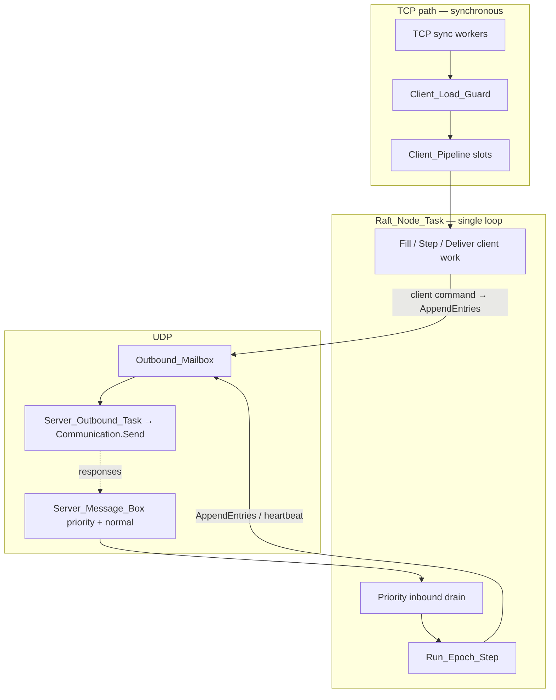

# Scheduling and priorities under client load

This document explains how the AdaRaft **examples** server schedules Raft work
under client load: the main loop order, epoch/heartbeat timing, inbound
priorities, and why heartbeats can slip.

For the client TCP pipeline, `Busy` / `Error`, queues capacities, load-harness
rules, and stress playbooks, see
[client_connections_queues_load.md](client_connections_queues_load.md).
For the wire protocol and CLI, see [client_api.md](client_api.md).

## Server implementation units

`Network_Node` remains the public facade. The server implementation is organized as:

| Unit | Responsibility |
|------|----------------|
| `Network_Node.Shared` | Node-wide state, configuration, logging, and metrics |
| `Network_Node.Inbound` | Priority inbound queue and drain/backlog accounting |
| `Network_Node.Outbound` | Asynchronous UDP mailbox and sender task |
| `Network_Node.Client_API` | Sync client admission, pipeline, and response handling |
| `Network_Node.Audit` | Audit TCP listener and framed status responses |
| `Network_Node.Engine` | Raft callbacks, timers, initialization, and main task |


---

## Summary

Under heavy client load the leader does **not** disable Raft timers. Timers
only advance when `Raft_Node_Task` reaches `Run_Epoch_Step`. The loop can slip
because:

1. A **single** `Raft_Node_Task` drains UDP, ticks epochs, and steps client work.
2. Clients retry pending sends every **`Loop_Interval` (50 ms)** while waiting
   for commit (`network_client.adb`).
3. If drain + client work run long, heartbeats miss their **~50 ms**
   target and followers may hit **~1.5 s** election timeouts.

Outbound UDP is **queued** (`Outbound_Mailbox` → `Server_Outbound_Task`) so
`Raft_Node_Task` does not block on each `Communication.Send`.

There **is** an inbound priority split (control requests vs normal traffic).
There is **no** separate “heartbeat task” that runs above client work.

---

## Task architecture (current)

Each node in `examples/src/network_node.adb`:

| Component | Concurrency | Role |
|-----------|-------------|------|
| TCP sync handlers | Parallel (accept workers) | `Client_Sync_Handler` per connection |
| `Client_Pipeline` | `Max_Client_Pipeline_Slots` (**1**) | Slot queue between TCP and Raft |
| `Raft_Node_Task` | **1** | Epoch loop, inbound drain, client Fill/Step/Deliver |
| `Server_Outbound_Task` | **1** | Drain `Outbound_Mailbox`; UDP `Communication.Send` |
| `Audit_Server_Task` | **1** | Read-only monitor TCP (`raft_port + 300`) |



**Not present anymore:** `Client_Comms_Task`, `Server_Comms_Task`,
`Client_Message_Box`, or `Raft_Client_Mailbox`. Those names in older notes
referred to a previous layout.

**Key point:** client TCP is still **sync** end-to-end. A TCP worker attaches a
pipeline slot and polls until Raft delivers a response or `Client_Timeout_S`
elapses.

---

## Raft_Node_Task loop order

Current main loop (simplified from `Raft_Node_Task`):

```
loop
   if Severely_Backlogged then          -- pending > 256
      Drain_Priority_Control_Inbound;   -- priority queue only
   end if;

   if Inbound_Backlogged then           -- pending > 32
      -- several priority drain rounds
   else
      Drain_Priority_Server_Inbound;
   end if;

   while Clock >= Next_Epoch and epochs_this_iter < 1 loop
      Run_Epoch_Step;                   -- timers / heartbeat
      Process_Server_Inbound_Batch (8); -- after each epoch
   end loop;

   if Leader then
      Step_All_Client_Work;
      Deliver_Completed_Client_Work;
      if Client_Work_Allowed then
         Fill_Client_Work_Slots;        -- paused when backlogged
      end if;
   else
      Abort / flush client pipeline;    -- redirects
   end if;

   delay Poll_Interval;                 -- 50 ms if inbox empty, else 1 ms
end loop;
```

### Implicit priority each iteration

| Order | Step | Notes |
|-------|------|-------|
| 1 | Priority (and bounded) inbound drain | Favours control **requests** when backlogged |
| 2 | `Run_Epoch_Step` | At most **one** epoch per loop iteration |
| 3 | Extra inbound batch (up to 8) | After the epoch step |
| 4 | Client Step / Deliver / Fill | Fill skipped if not `Client_Work_Allowed` |
| 5 | `delay` | `Poll_Interval` |

There is **no** hard time-slice that guarantees heartbeats if a single
`Handle_Leader_Send_Append_Entries` or UDP `Send` blocks for a long time.

---

## Raft timers and heartbeats

Timers are **epoch-based**. One epoch ≈ one `Run_Epoch_Step` when the loop
reaches the wall-clock boundary (`Next_Epoch`).

| Constant | Value | Wall-clock (default) |
|----------|-------|----------------------|
| `Epoch_Interval` / `Loop_Interval` | 0.05 s | 50 ms |
| `Heartbeat_Interval_Epochs` | 1 | **~50 ms** between heartbeats |
| `Election_Timeout_Epochs` | 30 (+ jitter) | **~1.5 s** follower election timeout |
| `Client_Timeout_S` | **2.0 s** | Sync wait for commit reply (current config) |

On heartbeat expiry (leader path in `src/raft-node.adb`):

1. `Timer_Timeout (Heartbeat_Timer)` is handled in the leader machine.
2. Heartbeat timer is restarted.
3. `Handle_Leader_Send_Append_Entries` sends to each follower via
   `Sending` → `Send_Outbound_Message` → `Send_Outbound_Payload` →
   **`Outbound_Mailbox.Enqueue`** (non-blocking in `Raft_Node_Task`).
   `Server_Outbound_Task` later performs `Communication.Send`.

Heartbeats only fire when the loop **reaches** `Run_Epoch_Step`. If the task
spends too long on client/inbound work, epoch ticks **slip** — outbound UDP
I/O itself no longer blocks that loop.

---

## Outbound UDP

Inter-node sends go through `Outbound_Mailbox` (capacity **2048**, drop-oldest)
and a dedicated `Server_Outbound_Task` that calls `Communication.Send` on
`Net_Links (Local_Id)`.

`Raft_Node_Task` only copies the payload into the mailbox, so it can continue
to:

- run the next `Run_Epoch_Step`,
- drain more inbound messages,
- step client work slots,

without waiting on inter-server send timeouts (`Inter_Server_Timeout`).

Monitor fields: `pending_outbound`, `outbound_dropped`.

Client commands that append to the log still trigger the same
`Handle_Leader_Send_Append_Entries` path as heartbeats; both enqueue on the
shared outbound mailbox.

---

## Inbound UDP priorities

`Server_Message_Box` (capacity **8192** total):

| Sub-queue | Capacity | Contents |
|-----------|----------|----------|
| Priority | 512 | `AppendEntries_Request`, `Request_Vote_Request`, `Install_Snapshot_Request` |
| Normal | 7680 | Including **`AppendEntries_Response`**, other traffic |

Overflow: **drop oldest** in the affected sub-queue (`inbound_dropped`).

Implications under load:

- Control **requests** (including step-down heartbeats from a new leader) are
  preferred when draining under backlog.
- Replication **responses** on the normal queue can still be dropped → commit
  stalls → client retries → more pressure.
- If the loop cannot drain priority in time, a leader can remain a **zombie**
  (old term) while another node is already leader — see
  [client_connections_queues_load.md](client_connections_queues_load.md).

Drain budgets (current constants):

| Constant | Value | Role |
|----------|-------|------|
| `Raft_Inbound_Backlog_Max` | 32 | “Backlogged”; pause client Fill |
| `Client_Work_Inbound_Cap` | 16 | Fill requires `pending ≤ 16` |
| `Severe_Backlog_Threshold` | 256 | Priority-only drain mode |
| `Max_Inbound_Per_Epoch` | 8 | After each epoch step |
| `Max_Inbound_Per_Loop` | 64 | General drain batching |
| `Drain_Yield` | 1 ms | Used when inbox non-empty (`Poll_Interval`) |

---

## Client retries and scheduling load

### Client side (`network_client.adb`)

`Send_Command`:

- Deadline: `Client_Timeout_S` (**2 s** currently).
- Loop delay: `Loop_Interval` (**50 ms**).
- While `Phase = Sending`, each iteration may call `Retry_Pending_Command`
  (another sync TCP RPC with the same serial).

So one slow commit can still produce many TCP attempts (~40 over 2 s).

### Leader side

- Same `(Client_Id, Serial)` already **pending** → no second log append.
- Already **committed** → cached session response.
- Overload / backlog / full pipeline → **`Busy`** (keep session, retry).
- Unknown session → **`Error`** (re-register).

Duplicate serials are cheap for the log, but each TCP attempt still costs
accept/handler time and may compete for the single pipeline slot.

---

## Load limits (scheduling-relevant)

| Mechanism | Limit | Effect on scheduling |
|-----------|-------|----------------------|
| `Max_Client_In_Flight` | **4** | Caps concurrent sync handlers (`Busy` when full) |
| `Max_Client_Pipeline_Slots` | **1** | One Raft-side client RPC in the pipeline |
| `Client_Work_Allowed` | pending ≤ 16 and not backlogged | Pauses **Fill**, keeps Step/Deliver |
| `Server_Message_Box` | 8192; drop oldest | Can drop AE responses under flood |
| `Outbound_Mailbox` | 2048; drop oldest | Decouples Raft loop from UDP send I/O |

Rejected overload paths return a framed **`Busy`** response when possible (not
a silent close). Details:
[client_connections_queues_load.md](client_connections_queues_load.md).

---

## Feedback loop under intensive retry

```
Many retries (50 ms) and/or parallel processes
  → pipeline=1 + in-flight=4 admit/reject Busy
  → commits slow if AE responses delayed/dropped
  → more TCP attempts
  → Raft_Node_Task spends longer in drain / client Step
  → Run_Epoch_Step slips → late heartbeats
  → followers may elect → dual-leader / zombie risk if step-down RPCs lag
```

Outbound UDP I/O is off the Raft task, but `outbound_dropped` or a slow
`Server_Outbound_Task` can still delay replication.

Symptoms:

- `client TCP rejected` / rising `client_rejected`
- `inbound_dropped` climbing; `pending_inbound` ≫ 32
- `send failed: timed out waiting for commit` / `cluster unreachable`
- Monitor `HEALTHY` but frozen `app_sum` (client path wedge), or
  `CRITICAL: multiple leaders`

---

## What the design intends vs stress reality

The loop **always attempts** inbound drain and epoch steps before/around client
work. That does **not** guarantee wall-clock heartbeat spacing when:

1. Inline UDP `Send` blocks the only Raft task.
2. Inbound queues grow faster than bounded drains.
3. Many TCP workers retry against a depth-1 pipeline.

The examples cluster favours a simple sync client API and a single Raft task
over isolating replication from client load.

---

## Mitigations (operational)

| Action | Rationale |
|--------|-----------|
| One `raft_client` at a time per `--name` | Harness enforces this; overlapping names wedge TCP |
| Keep `CONCURRENCY` ≤ number of distinct names | Cross-identity only |
| Throttle (`THROTTLE_EVERY`, `THROTTLE_SLEEP_S`) | Cuts 50 ms retry storms |
| Watch `pending_inbound`, `inbound_dropped`, `client_rejected` | Early overload signal |
| Prefer `send_load_dual_clients.py` over ad-hoc parallel shells | Safer defaults |

---

## Possible improvements (scheduling-focused)

1. **Stricter epoch-first / time-sliced client work** — bound Step and replication
   bursts per iteration.
2. **Prioritise or protect `AppendEntries_Response`** without letting response
   floods evict vote / AE requests.
3. **Stale-leader step-down** if majority heartbeat ACKs fail for an election
   timeout (book §6.2).
4. **Client exponential backoff** on `Busy` / timeout (beyond fixed 50 ms).

Done: **async / queued UDP outbound** (`Outbound_Mailbox` + `Server_Outbound_Task`).

---

## Related files

| File | Topic |
|------|-------|
| `examples/src/network_node.adb` | Loop, pipeline, inbox, outbound mailbox |
| `examples/src/example_config.ads` | Epochs, timeouts, in-flight / pipeline |
| `examples/src/network_client.adb` | Retry loop |
| `src/raft-node.adb` | Heartbeat, append, commit notify |
| `examples/doc/client_connections_queues_load.md` | Connections, queues, stress modes |
| `examples/doc/client_api.md` | Protocol / CLI |
| `examples/scripts/send_load_dual_clients.py` | Load harness (per-name exclusive) |
